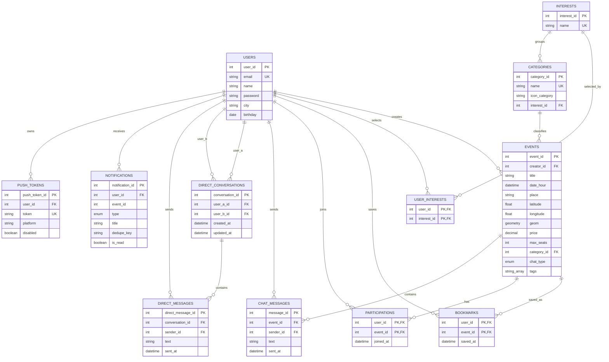

# Evnt - Schema database riallineato

Schema aggiornato sulla base di `evnt-backend/prisma/schema.prisma` e dello script PostGIS `evnt-backend/prisma/sql/postgis.sql`.

## Tecnologia

- DBMS: PostgreSQL.
- Estensione geospaziale: PostGIS.
- ORM: Prisma.
- Chiavi primarie intere autoincrementali o composte dove indicato.
- Coordinate evento salvate come `latitude`/`longitude`; colonna PostGIS `geom geometry(Point,4326)` generata via SQL.

## Enum

### ChatType

| Valore | Significato |
|---|---|
| `OPEN_GROUP` | Chat evento aperta ai partecipanti e al creatore. |
| `ANNOUNCEMENTS` | Chat evento in sola lettura per i partecipanti; scrive solo il creatore. |

### NotificationType

| Valore | Significato |
|---|---|
| `NEW_MATCH` | Nuovo evento coerente con interessi/citta dell'utente. |
| `SAVED_EVENT_REMINDER` | Reminder per evento salvato previsto il giorno dopo. |
| `EVENT_STARTING` | Reminder per evento iscritto in partenza entro un'ora. |
| `EVENT_UPDATED` | Evento modificato in data/orario o luogo. |
| `EVENT_CANCELLED` | Evento annullato dal creatore. |
| `LOW_SEATS` | Pochi posti rimanenti. |
| `EVENT_FULL` | Evento al completo. |
| `CHAT_MESSAGE` | Nuovo messaggio chat o diretto. |
| `ORGANIZER_ANNOUNCEMENT` | Messaggio dell'organizzatore nella chat evento. |

## Entita e attributi

### users

| Campo | Tipo | Vincoli/Note |
|---|---|---|
| `user_id` | Int | PK, autoincrement |
| `email` | VarChar(255) | Unique, normalizzata lowercase |
| `name` | VarChar(120) | Obbligatorio |
| `bio` | Text | Nullable |
| `password` | VarChar(255) | Hash bcrypt |
| `city` | VarChar(120) | Nullable |
| `image` | Text | Nullable, URL o data image base64 |
| `birthday` | Date | Usata per soglia 16+ |
| `created_at` | DateTime | Default `now()` |

### interests

| Campo | Tipo | Vincoli/Note |
|---|---|---|
| `interest_id` | Int | PK, autoincrement |
| `name` | VarChar(120) | Unique |

### user_interests

| Campo | Tipo | Vincoli/Note |
|---|---|---|
| `user_id` | Int | PK composta, FK `users.user_id`, cascade delete |
| `interest_id` | Int | PK composta, FK `interests.interest_id`, cascade delete |

### categories

| Campo | Tipo | Vincoli/Note |
|---|---|---|
| `category_id` | Int | PK, autoincrement |
| `name` | VarChar(120) | Unique |
| `icon_category` | VarChar(120) | Icona/emoji categoria |
| `interest_id` | Int | FK `interests.interest_id` |

### events

| Campo | Tipo | Vincoli/Note |
|---|---|---|
| `event_id` | Int | PK, autoincrement |
| `creator_id` | Int | FK `users.user_id` |
| `title` | VarChar(200) | Obbligatorio |
| `description` | Text | Obbligatorio, default applicativo vuoto |
| `date_hour` | DateTime | Data/ora inizio |
| `place` | VarChar(255) | Nome luogo |
| `address` | VarChar(255) | Nullable |
| `city` | VarChar(120) | Nullable |
| `province` | VarChar(120) | Nullable |
| `region` | VarChar(120) | Nullable |
| `postcode` | VarChar(20) | Nullable |
| `country_code` | VarChar(2) | Nullable, uppercase |
| `latitude` | Float | Obbligatorio |
| `longitude` | Float | Obbligatorio |
| `geom` | Geometry(Point,4326) | Generata da PostGIS, non gestita direttamente da Prisma |
| `price` | Decimal(10,2) | Default 0; informativo, nessun pagamento |
| `max_seats` | Int | Nullable, null = illimitato |
| `category_id` | Int | FK `categories.category_id`, indice |
| `chat_type` | ChatType | Default `OPEN_GROUP` |
| `is_live` | Boolean | Default false |
| `image` | Text | Nullable |
| `tags` | String[] | Default `[]`; contiene tag pubblici e tag tecnici come `subcategory:*`, `city:*`, `status:cancelled` |
| `created_at` | DateTime | Default `now()` |

### bookmarks

| Campo | Tipo | Vincoli/Note |
|---|---|---|
| `user_id` | Int | PK composta, FK `users.user_id`, cascade delete |
| `event_id` | Int | PK composta, FK `events.event_id`, cascade delete |
| `saved_at` | DateTime | Default `now()` |

### participations

| Campo | Tipo | Vincoli/Note |
|---|---|---|
| `user_id` | Int | PK composta, FK `users.user_id`, cascade delete |
| `event_id` | Int | PK composta, FK `events.event_id`, cascade delete |
| `joined_at` | DateTime | Default `now()` |

### chat_messages

| Campo | Tipo | Vincoli/Note |
|---|---|---|
| `message_id` | Int | PK, autoincrement |
| `event_id` | Int | FK `events.event_id`, cascade delete, indice |
| `sender_id` | Int | FK `users.user_id`, cascade delete |
| `text` | Text | Messaggio evento |
| `sent_at` | DateTime | Default `now()` |

### direct_conversations

| Campo | Tipo | Vincoli/Note |
|---|---|---|
| `conversation_id` | Int | PK, autoincrement |
| `user_a_id` | Int | FK `users.user_id`, cascade delete, indice |
| `user_b_id` | Int | FK `users.user_id`, cascade delete, indice |
| `created_at` | DateTime | Default `now()` |
| `updated_at` | DateTime | Aggiornato automaticamente |

Vincolo: coppia unica `(user_a_id, user_b_id)`. L'app ordina gli id utente in modo canonico per evitare duplicati A-B/B-A.

### direct_messages

| Campo | Tipo | Vincoli/Note |
|---|---|---|
| `direct_message_id` | Int | PK, autoincrement |
| `conversation_id` | Int | FK `direct_conversations.conversation_id`, cascade delete, indice |
| `sender_id` | Int | FK `users.user_id`, cascade delete, indice |
| `text` | Text | Messaggio diretto |
| `sent_at` | DateTime | Default `now()` |

### notifications

| Campo | Tipo | Vincoli/Note |
|---|---|---|
| `notification_id` | Int | PK, autoincrement |
| `user_id` | Int | FK `users.user_id`, cascade delete, indice |
| `event_id` | Int | Nullable, indice; riferimento logico a evento |
| `type` | NotificationType | Default `NEW_MATCH` |
| `title` | VarChar(200) | Titolo notifica |
| `message` | Text | Corpo notifica |
| `dedupe_key` | VarChar(240) | Nullable; evita duplicati applicativi |
| `is_read` | Boolean | Default false |
| `created_at` | DateTime | Default `now()` |

### push_tokens

| Campo | Tipo | Vincoli/Note |
|---|---|---|
| `push_token_id` | Int | PK, autoincrement |
| `user_id` | Int | FK `users.user_id`, cascade delete, indice |
| `token` | VarChar(255) | Unique |
| `platform` | VarChar(40) | iOS/Android/Web runtime |
| `device_id` | VarChar(120) | Nullable |
| `disabled` | Boolean | Default false |
| `created_at` | DateTime | Default `now()` |
| `updated_at` | DateTime | Aggiornato automaticamente |

## Relazioni e cardinalita

| Relazione | Cardinalita | Descrizione |
|---|---|---|
| `User -> Event` | 1:N | Un utente crea molti eventi; un evento ha un solo creatore. |
| `User <-> Interest` | N:N | Tramite `user_interests`. |
| `Interest -> Category` | 1:N | Un interesse raggruppa piu categorie. |
| `Category -> Event` | 1:N | Ogni evento appartiene a una categoria. |
| `User <-> Event` preferiti | N:N | Tramite `bookmarks`. |
| `User <-> Event` partecipazioni | N:N | Tramite `participations`. |
| `Event -> ChatMessage` | 1:N | Un evento ha molti messaggi chat. |
| `User -> ChatMessage` | 1:N | Un utente invia molti messaggi evento. |
| `User -> DirectConversation` | 1:N per ruolo A/B | Un utente puo partecipare a molte conversazioni dirette. |
| `DirectConversation -> DirectMessage` | 1:N | Una conversazione diretta contiene molti messaggi. |
| `User -> DirectMessage` | 1:N | Un utente invia molti messaggi diretti. |
| `User -> Notification` | 1:N | Un utente riceve molte notifiche. |
| `Event -> Notification` | 0:N logica | Alcune notifiche sono collegate a evento tramite `event_id`; non e definita relation Prisma. |
| `User -> PushToken` | 1:N | Un utente puo avere piu token dispositivo. |

## Diagramma ER Mermaid

## Indici e vincoli rilevanti

| Oggetto | Vincolo/Indice |
|---|---|
| `users.email` | Unique |
| `interests.name` | Unique |
| `categories.name` | Unique |
| `events.category_id` | Index |
| `events.creator_id` | Index |
| `events.geom` | GiST spatial index creato da `postgis.sql` |
| `bookmarks` | PK composta `(user_id, event_id)` |
| `participations` | PK composta `(user_id, event_id)` |
| `chat_messages.event_id` | Index |
| `direct_conversations(user_a_id, user_b_id)` | Unique |
| `direct_conversations.user_a_id` | Index |
| `direct_conversations.user_b_id` | Index |
| `direct_messages.conversation_id` | Index |
| `direct_messages.sender_id` | Index |
| `notifications.user_id` | Index |
| `notifications.event_id` | Index |
| `push_tokens.token` | Unique |
| `push_tokens.user_id` | Index |

## Note di progettazione

- Non esiste una tabella `Payment`: il prezzo evento e un'informazione visualizzata, non un checkout.
- Non esiste una tabella/relazione `Role`: un organizzatore e semplicemente l'utente creatore di un evento.
- L'annullamento evento e gestito logicamente con il tag tecnico `status:cancelled`; le query feed escludono questi eventi.
- Le sottocategorie e la citta normalizzata sono salvate anche nei `tags` con prefissi tecnici `subcategory:` e `city:`.
- `Notification.event_id` e un riferimento logico usato dall'app per riaprire l'evento, ma nel modello Prisma attuale non e definita una relazione formale verso `Event`.
- La colonna `geom` viene mantenuta da SQL/PostGIS, mentre Prisma legge e scrive latitudine/longitudine.

## Differenze principali rispetto al modello ER originale

| Area | Modello originale | Modello attuale |
|---|---|---|
| Messaggistica | Solo `CHAT_MESSAGE` evento | Aggiunti `direct_conversations` e `direct_messages` |
| Notifiche push | Solo `NOTIFICATION` | Aggiunta `push_tokens` |
| Evento | Campo `geom`, dati luogo essenziali | Aggiunti address, city, province, region, postcode, country_code, latitude, longitude, image, tags, created_at |
| Notifiche | Titolo, messaggio, lettura | Aggiunti type, event_id, dedupe_key |
| Stato evento | `is_live` | `is_live` piu stato tecnico via tag `status:cancelled` |
| Pagamenti | Impliciti nei requisiti | Nessuna entita pagamento |
